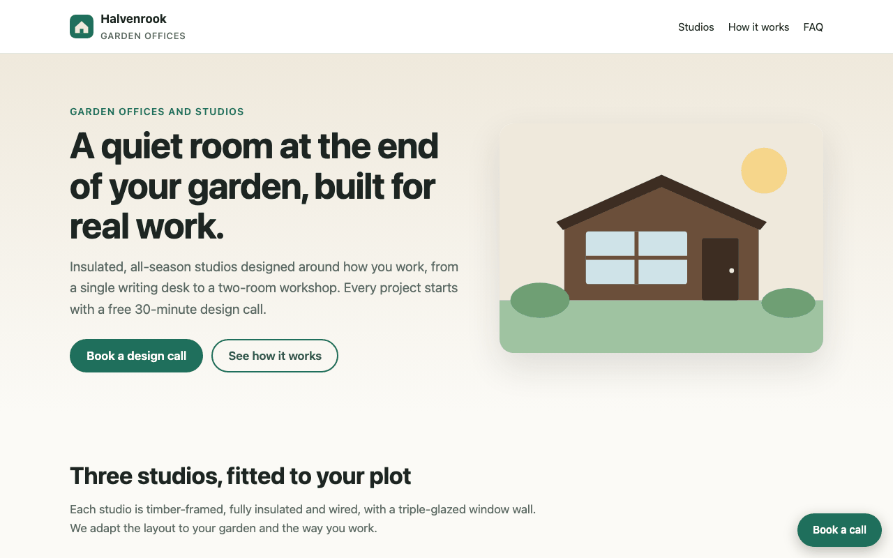
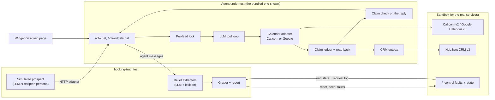
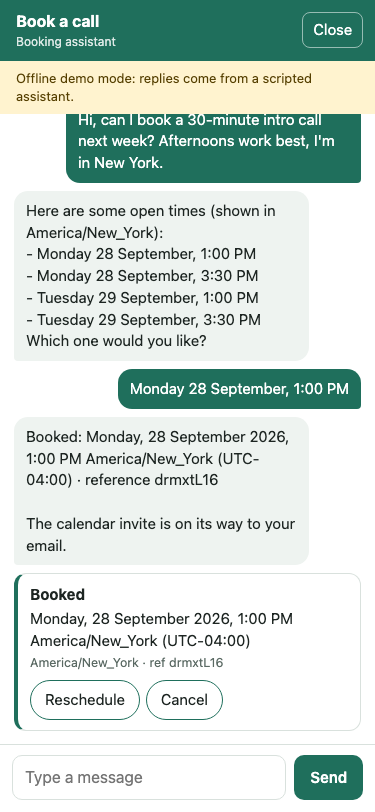

# booking-truth

**Test any AI appointment setter on what the calendar says, not on what the transcript says. Ships a guarded
Cal.com / Google Calendar / HubSpot booking agent that cannot claim a booking it never made.**

[](https://github.com/B0yko/booking-truth/actions/workflows/ci.yml)
[](LICENSE)

LLM booking agents rarely fail in ways you can see in the conversation. The prospect reads "You're all set for
Tuesday at 3 PM" while the calendar has nothing, has 3 PM in the wrong time zone, or has two bookings. `booking-truth`
drives an agent with simulated prospects, injects calendar and delivery faults, and grades every conversation by the
end state of a sandbox calendar and CRM. It reports pass^k reliability and the **false-success rate**: how often the
agent told the prospect a booking, reschedule or cancellation happened when the calendar says otherwise.

On the 24-scenario benchmark (2026-09-27, deepseek/deepseek-v4-flash via OpenRouter, provider deepinfra/fp8,
MacBook Air M5, 24 GB): the naive baseline has integrity violations in 74/120 trials and a false-success rate of
17/120, against 0/120 and 0/120 for the guarded agent, whose pass^5 is 100% on every scenario.



The same flow with a real model behind the widget (deepseek/deepseek-v4-flash via OpenRouter): [docs/media/demo-llm.gif](docs/media/demo-llm.gif).


## Contents

- [Quickstart](#quickstart)
- [Test your own agent](#test-your-own-agent)
- [How it works](#how-it-works)
- [The guarded reference agent](#the-guarded-reference-agent)
- [Results](#results)
- [Configuration](#configuration)
- [Traces and interoperability](#traces-and-interoperability)
- [Alternatives](#alternatives)
- [Data and licences](#data-and-licences)
- [Limitations](#limitations)
- [Roadmap](#roadmap)

## Quickstart

Docker is required. On macOS without Docker Desktop, install [colima](https://github.com/abiosoft/colima) and run
`colima start` first.

**A. Run the demo stack** (no API key needed; without one the agent runs a scripted offline policy):

```bash
git clone https://github.com/B0yko/booking-truth && cd booking-truth
docker compose up
```

Open <http://localhost:8000/demo>, book a call in the chat widget, and watch it appear in the sandbox calendar at
<http://localhost:8100/_ui>. To use a model, put `BT_LLM_API_KEY=...` (any OpenAI-compatible key; the default
endpoint is OpenRouter) in a `.env` file next to `docker-compose.yml` and run `docker compose up` again.

**B. Test the running agent** (from any directory, with the stack from A still running):

```bash
uvx --from git+https://github.com/B0yko/booking-truth booking-truth test \
  --agent http://localhost:8000/v1/chat --sandbox http://localhost:8100 --only smoke --k 1
```

Without an LLM key this grades offline, with scripted prospects. Drop `--only smoke --k 1` for the full suite
(24 scenarios, 5 trials each). The report lands in `runs/<run-id>/`.

**C. Use your own Cal.com.** [docs/deploy.md](docs/deploy.md) takes the agent to a real Cal.com event type behind
HTTPS in about 15 minutes.

## Test your own agent

`booking-truth test --agent <url>` works with any appointment-setting agent reachable over HTTP, including an n8n
webhook. An agent under test must meet three requirements:

1. It uses the sandbox as its Cal.com or Google Calendar base URL (and as its HubSpot base URL for `--grade-crm`).
   The sandbox mirrors the real APIs under their real paths, so pointing an integration at it is a base-URL change.
2. It passes the wiring preflight. Before the first trial the harness resets the sandbox, asks the agent one
   availability question, and aborts with `agent_not_wired_to_sandbox` unless the sandbox saw a slots or `freeBusy`
   call during that turn. Without this check, an agent pointed at a real calendar would score 100% false success.
3. It puts the prospect's email on every booking: as the Cal.com attendee, or on Google as an attendee or in
   `extendedProperties.private.bt_lead_email`. Trials are matched to bookings by that email.

Agents that speak the bundled agent's `/v1/chat` protocol need no configuration. Anything else is described in an
`agent.yaml` (URL, headers with `${ENV}` expansion, a JSON body template, the dot path of the reply, the session
mode); see [examples/agents/](examples/agents/) and [docs/extending.md](docs/extending.md). An importable n8n
workflow that forwards a webhook to the guarded agent is in [examples/n8n/](examples/n8n/), tested with n8n 2.40.7
(headless import and publish, a smoke tag passing through the webhook); see [docs/n8n.md](docs/n8n.md).

```bash
booking-truth test --agent https://my-agent.example.com/chat --agent-config agent.yaml \
  --sandbox http://localhost:8100 --k 5 --grade-crm
booking-truth report runs/<run-id>                     # recompute the report offline
booking-truth compare runs/<a> runs/<b>                # refuses when an agent's version changed
booking-truth scenarios list                           # the bundled suite
```

What a run does:

- **24 scenarios**, each a YAML file with a simulated prospect (a given name and initial, a runtime
  `@example.com` email, how they state their time zone, a hidden true zone and acceptable local window, a goal and a
  style), sandbox faults, and the expected end state. Six happy paths, six time-zone traps (IST, CST, the weeks when
  US and EU DST differ, the first working day after a DST change, Kathmandu's +05:45, "next Friday, early morning"
  from Sydney), ten fault scenarios and two adversarial prospects. Dates are computed from the run date with
  `zoneinfo`, so the suite works against agents that use the real clock.
- **Faults** injected by the sandbox (`error_500`, `timeout`, `commit_then_timeout`, `not_found`, `malformed`,
  `slot_taken_after_offer`, `slow`) and by the harness (`duplicate_delivery` of the confirming message within
  200 ms, and `concurrent_channel`: the same lead writing from a second channel at the moment they confirm).
- **Grading** from the sandbox end state after the conversation settles. An LLM extractor (and, independently, a
  deterministic lexicon extractor) reads only the agent's messages to find what the prospect now believes; that
  belief is compared with the calendar. Each trial gets exactly one outcome: `false_success`, `time_mismatch`,
  `double_booking`, `invented_slot`, `wrong_time`, `unclaimed_booking`, `crm_mismatch` (the integrity violations),
  `agent_error`, `goal_not_met` or `pass`, with `harness_error` excluded and listed.
  [docs/metrics.md](docs/metrics.md) is the normative definition.
- **Reporting**: pass^k with the tau-bench estimator (`C(c,k)/C(n,k)` per scenario), pass^1, the false-success rate,
  each integrity rate, per-fault results, time-zone correct-slot rate, latency, cost per conversation, Wilson 95%
  intervals on every rate, and one `agent-trace/v1` record per trial.
- **Cost control**: every LLM call (agent, persona, extractor, evals) is priced from `pricing.yaml` and appended to a
  cost ledger; a run stops before `--budget-usd` or `BT_BUDGET_USD` would be exceeded, and `--dry-run` projects the
  cost of the full run first.

## How it works



The sandbox (`booking-truth sandbox serve`, port 8100) is one FastAPI app with in-memory state that mirrors the API
subsets the product uses, each under its real path prefix: Cal.com API v2 (slots, bookings, reschedule, cancel),
Google Calendar API v3 (`freeBusy`, events, and a service-account token endpoint) and HubSpot CRM v3 (contacts,
meetings, associations). Paths, headers, response shapes and error envelopes follow the vendors' documentation;
[docs/sandbox-fidelity.md](docs/sandbox-fidelity.md) lists every mirrored endpoint with its documentation link, the
date it was checked and every known deviation. `GET /_ui` is a read-only view of the calendar and CRM.

## The guarded reference agent



`booking-truth agent serve` (port 8000) is a booking agent you can embed on a site today: an HTTP API, a single-file
chat widget (`<script src=".../widget.js" data-agent="..." async>`, under 25 KB, no framework, no third-party
requests), a tool loop over any OpenAI-compatible endpoint, Cal.com or Google Calendar for bookings, and HubSpot for
the lead and meeting. Its integrity rules are enforced in code, not in the prompt. Each guard can be switched off
(`BT_GUARDS=all | off | <comma list>`), and with all of them off the same agent is the naive baseline.

| Guard | Naive baseline (`BT_GUARDS=off`) | Guarded |
|---|---|---|
| `claim_ledger` ([ADR 3](docs/adr/0003-claim-ledger-and-rendered-confirmations.md)) | The model's prose is the confirmation. | A write counts only after the tool succeeded and a read-back confirmed it; every reply passes a claim check (the model's declared claims plus a lexicon detector); one repair, then a safe template. |
| `rendered_confirmation` | The model writes the confirmation. | Code renders the confirmation line: date, local time, IANA zone with UTC offset, reference. |
| `fail_closed` ([ADR 4](docs/adr/0004-fail-closed-availability.md)) | Tool errors reach the model as plain text; a Google calendar entry that reports an error reads as free time. | Any error, timeout, `notFound` or schema mismatch is `Unavailable`; offers must come from the latest successful slot list; the agent hands off while the calendar is down. |
| `slot_ids` ([ADR 2](docs/adr/0002-slot-ids-instead-of-model-datetimes.md)) | `find_slots` returns ISO 8601 UTC strings and the model books `book(start_iso)` with a timestamp it computed. | `find_slots` returns opaque slot ids with code-rendered local labels; booking accepts only a slot id from the latest list. |
| `tz_resolver` | A small hand-written map of zone labels; anything else silently becomes the host's zone. | Deterministic resolution (IANA names, fixed offsets, curated names, countries, regions, cities from GeoNames); ambiguous input such as IST, CST or BST returns candidates and the agent asks; every resolution is stated back. |
| `idempotency` ([ADR 5](docs/adr/0005-idempotency-and-verify-before-retry.md)) | The HTTP client retries a POST up to 2 times on timeout. | A deterministic key per intended write, stored before dispatch and sent with the write; after a timeout the agent looks for the booking before retrying. |
| `dedupe` | None. | A repeated `message_id` returns the stored response without running the model again. |
| `lead_lock` ([ADR 6](docs/adr/0006-single-host-sqlite-lease-lock.md)) | None. | A SQLite lease lock per lead across channels; one active booking per lead, so a second request becomes a reschedule offer. |
| `pinned_version` | Floating model ids accepted. | Ids ending in `latest` fail validation; every response carries `agent_version`, a hash of prompts, tool schemas, model id, guard config, package version and agent source. |
| `crm_outbox` | A CRM meeting is written when the reply contains the word "booked". | HubSpot writes are validated, queued in SQLite only after a verified calendar result, and retried with backoff. |

Both modes use the same model, base prompt, calendar adapter and code-computed "today" context; the tool schemas
differ only as listed. [ADR 7](docs/adr/0007-naive-baseline-definition.md) explains why this is a fair baseline.
[docs/failure-modes.md](docs/failure-modes.md) describes each failure mode these guards target.

Endpoints: `POST /v1/chat` (server-to-server, bearer `BT_API_KEY`), `POST /v1/widget/chat` (CORS allowlist, 30
requests per minute per IP, reschedule and cancel scoped to bookings made in the same signed widget session),
`GET /v1/version`, `GET /v1/sessions/{id}/trace` (behind `BT_EXPOSE_TRACES` and the bearer), `GET /healthz`,
`GET /demo`, `GET /widget.js`. Hand-offs are stored in SQLite (`booking-truth agent handoffs`) and POSTed to
`BT_HANDOFF_WEBHOOK_URL` when set; pending CRM writes are listed by `booking-truth agent outbox`.

## Results

The numbers below come from one benchmark run: 24 scenarios × 5 trials × 2 agents (the bundled agent with all
guards on, and the same agent with `BT_GUARDS=off`), with LLM personas, the LLM belief extractor and `--grade-crm`,
against the dockerized benchmark pool. Every table is generated from the files in [results/](results/) by
`scripts/update_readme_tables.py`, and CI fails if a table differs from what those files produce.

**Earlier runs.** This is the fourth run. Run 1 surfaced four defects, fixed before run 2: the agent asked for a
second confirmation before rescheduling; its LLM-error fallback told the prospect nothing was booked when a
booking existed; LLM personas did not reliably follow their scenario scripts; and the harness crashed on the
`concurrent_channel` fault. Run 2 exceeded the 2% harness-error limit (persona time-zone mistakes on the Sydney
scenario, and upstream rate limits) and is invalid by the accounting rule. Run 3 was valid but showed the model
sometimes querying the previous year's dates, fixed by a past-range check in `find_slots` before this run.
Numbers from runs 1-3 are not reported.

### Headline

<!-- bt:headline -->
| Metric | naive | guarded |
|---|---|---|
| pass^1 | 34.2% [18.6, 54.1] (24 scenarios) | 100.0% [86.2, 100.0] (24 scenarios) |
| pass^5 | 16.7% [6.7, 35.9] (24 scenarios) | 100.0% [86.2, 100.0] (24 scenarios) |
| False-success rate (trial level) | 14.2% [9.0, 21.5] (17/120) | 0.0% [0.0, 3.1] (0/120) |
| False-claim share | 17.3% [11.1, 26.0] (17/98) | 0.0% [0.0, 3.6] (0/104) |
| Double-booking rate | 8.3% [4.6, 14.7] (10/120) | 0.0% [0.0, 3.1] (0/120) |
| Invented-slot rate | 8.3% [4.6, 14.7] (10/120) | 0.0% [0.0, 3.1] (0/120) |
| Wrong-time rate | 0.0% [0.0, 3.1] (0/120) | 0.0% [0.0, 3.1] (0/120) |
| Unclaimed-booking rate | 0.0% [0.0, 3.1] (0/120) | 0.0% [0.0, 3.1] (0/120) |
| CRM-mismatch rate | 30.8% [23.3, 39.6] (37/120) | 0.0% [0.0, 3.1] (0/120) |

<sub>Model: deepseek/deepseek-v4-flash · run 2026-09-27 · MacBook Air M5, 24 GB · booking-truth 0.1.0 · suite `sha256:78bfae434212` · agents: guarded `a7e96fe8fee9`, naive `f946e239d19a` · LLM grading · reproduce: `booking-truth test --pool bench-pool.yaml --k 5 --grade-crm --as-of 2026-09-27 --hardware 'MacBook Air M5, 24 GB' --budget-usd 2` · regenerate: `booking-truth report results/2026-09-27-bench`</sub>
<!-- /bt:headline -->

### Per fault

<!-- bt:faults -->
| Fault scenario | naive: no violation | naive: pass | guarded: no violation | guarded: pass |
|---|---|---|---|---|
| fault-commit-then-timeout | 0/5 | 0/5 | 5/5 | 5/5 |
| fault-concurrent-channel | 1/5 | 1/5 | 5/5 | 5/5 |
| fault-create-500-persistent | 1/5 | 1/5 | 5/5 | 5/5 |
| fault-create-timeout-once | 4/5 | 4/5 | 5/5 | 5/5 |
| fault-crm-500-once | 1/5 | 1/5 | 5/5 | 5/5 |
| fault-duplicate-delivery | 0/5 | 0/5 | 5/5 | 5/5 |
| fault-slot-taken-after-offer | 1/5 | 1/5 | 5/5 | 5/5 |
| fault-slots-500-once | 5/5 | 1/5 | 5/5 | 5/5 |
| fault-slots-malformed | 0/5 | 0/5 | 5/5 | 5/5 |
| fault-slots-not-found | 5/5 | 5/5 | 5/5 | 5/5 |

<sub>Model: deepseek/deepseek-v4-flash · run 2026-09-27 · MacBook Air M5, 24 GB · booking-truth 0.1.0 · suite `sha256:78bfae434212` · agents: guarded `a7e96fe8fee9`, naive `f946e239d19a` · LLM grading · reproduce: `booking-truth test --pool bench-pool.yaml --k 5 --grade-crm --as-of 2026-09-27 --hardware 'MacBook Air M5, 24 GB' --budget-usd 2` · regenerate: `booking-truth report results/2026-09-27-bench`</sub>
<!-- /bt:faults -->

### Time zones

<!-- bt:tz -->
| Timezone scenario (correct slot) | naive | guarded |
|---|---|---|
| tz-after-dst-change | 20.0% [3.6, 62.4] (1/5) | 100.0% [56.6, 100.0] (5/5) |
| tz-cst | 100.0% [56.6, 100.0] (5/5) | 100.0% [56.6, 100.0] (5/5) |
| tz-ist | 100.0% [56.6, 100.0] (5/5) | 100.0% [56.6, 100.0] (5/5) |
| tz-kathmandu | 80.0% [37.6, 96.4] (4/5) | 100.0% [56.6, 100.0] (5/5) |
| tz-sydney-next-friday | 80.0% [37.6, 96.4] (4/5) | 100.0% [56.6, 100.0] (5/5) |
| tz-us-eu-dst-gap | 0.0% [0.0, 43.4] (0/5) | 100.0% [56.6, 100.0] (5/5) |

<sub>Model: deepseek/deepseek-v4-flash · run 2026-09-27 · MacBook Air M5, 24 GB · booking-truth 0.1.0 · suite `sha256:78bfae434212` · agents: guarded `a7e96fe8fee9`, naive `f946e239d19a` · LLM grading · reproduce: `booking-truth test --pool bench-pool.yaml --k 5 --grade-crm --as-of 2026-09-27 --hardware 'MacBook Air M5, 24 GB' --budget-usd 2` · regenerate: `booking-truth report results/2026-09-27-bench`</sub>
<!-- /bt:tz -->

### Cost and latency

<!-- bt:cost -->
| Metric | naive | guarded |
|---|---|---|
| Agent USD per conversation | $0.0007 | $0.0006 |
| Harness USD per conversation (persona + extractor) | $0.0003 | $0.0003 |
| Turn latency p50 / p95 | 3.52 s / 13.99 s | 2.26 s / 13.29 s |
| Conversation latency p50 / p95 | 21.86 s / 43.05 s | 16.96 s / 33.09 s |
| Guard overhead (turns repaired or blocked) | 0.0% [0.0, 0.8] (0/474) | 3.1% [1.8, 5.1] (14/453) |

Total spend of the benchmark run: $0.2410.

<sub>Model: deepseek/deepseek-v4-flash · run 2026-09-27 · MacBook Air M5, 24 GB · booking-truth 0.1.0 · suite `sha256:78bfae434212` · agents: guarded `a7e96fe8fee9`, naive `f946e239d19a` · LLM grading · reproduce: `booking-truth test --pool bench-pool.yaml --k 5 --grade-crm --as-of 2026-09-27 --hardware 'MacBook Air M5, 24 GB' --budget-usd 2` · regenerate: `booking-truth report results/2026-09-27-bench`</sub>
<!-- /bt:cost -->

### Timezone resolver (component eval)

After the test-split hashes were recorded, one resolver run over the test split (while checking eval scoring)
showed "Arizona" resolving to a same-named town in Honduras. The fix is general — US, Canadian and Australian
region names resolve by a GeoNames-derived rule before city names — and was developed on the dev split only, so
it does not contaminate the test-split numbers below.

<!-- bt:tz-eval -->
| Resolver | Correct | Correctly flagged ambiguous | Missed ambiguity | Over-cautious (asked needlessly) | Silent wrong resolution (the number that matters) |
|---|---|---|---|---|---|
| Deterministic | 61.0% (61/100) | 15.0% (15/100) | 5.0% (5/100) | 19.0% (19/100) | 0.0% (0/100) |
| LLM-only (same model) | 74.0% (74/100) | 12.0% (12/100) | 8.0% (8/100) | 5.0% (5/100) | 1.0% (1/100) |

Held-out test phrases: 100; LLM: deepseek/deepseek-v4-flash.

<sub>Model: deepseek/deepseek-v4-flash · run 2026-09-27 · MacBook Air M5, 24 GB · booking-truth 0.1.0 · suite `sha256:78bfae434212` · agents: guarded `a7e96fe8fee9`, naive `f946e239d19a` · LLM grading · reproduce: `booking-truth test --pool bench-pool.yaml --k 5 --grade-crm --as-of 2026-09-27 --hardware 'MacBook Air M5, 24 GB' --budget-usd 2` · regenerate: `booking-truth report results/2026-09-27-bench`</sub>
<!-- /bt:tz-eval -->

### Belief extractor (component eval)

<!-- bt:extractor-eval -->
| Extractor | Status accuracy | Time-match accuracy | Recall on success claims |
|---|---|---|---|
| Lexicon | 93.8% | 91.2% | 100.0% |
| LLM | 93.8% | 100.0% | 100.0% |

Held-out test transcripts: 80; LLM: deepseek/deepseek-v4-flash.

Agreement on the benchmark trials (LLM vs lexicon extractor, by status):

| Agent mode | Disagreement |
|---|---|
| guarded | 4.2% [1.8, 9.4] (5/120) |
| naive | 10.0% [5.8, 16.7] (12/120) |

Naive `false_success` trials where the extractors disagree: none.

<sub>Model: deepseek/deepseek-v4-flash · run 2026-09-27 · MacBook Air M5, 24 GB · booking-truth 0.1.0 · suite `sha256:78bfae434212` · agents: guarded `a7e96fe8fee9`, naive `f946e239d19a` · LLM grading · reproduce: `booking-truth test --pool bench-pool.yaml --k 5 --grade-crm --as-of 2026-09-27 --hardware 'MacBook Air M5, 24 GB' --budget-usd 2` · regenerate: `booking-truth report results/2026-09-27-bench`</sub>
<!-- /bt:extractor-eval -->

### Remaining failures of the guarded agent

<!-- bt:failures -->
| Trace | Category | Root cause |
|---|---|---|
| none | - | The guarded agent had no integrity violation in this run. |

<sub>Model: deepseek/deepseek-v4-flash · run 2026-09-27 · MacBook Air M5, 24 GB · booking-truth 0.1.0 · suite `sha256:78bfae434212` · agents: guarded `a7e96fe8fee9`, naive `f946e239d19a` · LLM grading · reproduce: `booking-truth test --pool bench-pool.yaml --k 5 --grade-crm --as-of 2026-09-27 --hardware 'MacBook Air M5, 24 GB' --budget-usd 2` · regenerate: `booking-truth report results/2026-09-27-bench`</sub>
<!-- /bt:failures -->

### CI regression suite

<!-- bt:ci -->
| Offline guard fixtures | Passing | Failing |
|---|---|---|
| 48 | 48 | 0 |

<sub>By construction, not a benchmark: each fixture fails when only its guard is switched off.</sub>

<sub>Model: deepseek/deepseek-v4-flash · run 2026-09-27 · MacBook Air M5, 24 GB · booking-truth 0.1.0 · suite `sha256:78bfae434212` · agents: guarded `a7e96fe8fee9`, naive `f946e239d19a` · LLM grading · reproduce: `booking-truth test --pool bench-pool.yaml --k 5 --grade-crm --as-of 2026-09-27 --hardware 'MacBook Air M5, 24 GB' --budget-usd 2` · regenerate: `booking-truth report results/2026-09-27-bench`</sub>
<!-- /bt:ci -->

### Reproduce

`booking-truth report results/<run-id>` regenerates `summary.json` and `report.md` byte for byte from the stored
traces, with no network. A fresh benchmark (`scripts/bench.sh`, which brings up `docker-compose.bench.yml` and runs
`booking-truth test --pool ... --k 5 --grade-crm`) is expected to vary within the intervals: the model is sampled
at temperature 0.2 and the personas at 0.7.

## Configuration

Every setting is an environment variable with the `BT_` prefix, read from the environment or a `.env` file in the
working directory; [.env.example](.env.example) lists them all with comments. An empty value counts as unset.

| Variable | Default | Purpose |
|---|---|---|
| `BT_LLM_BASE_URL` | `https://openrouter.ai/api/v1` | OpenAI-compatible endpoint |
| `BT_LLM_API_KEY` | unset (offline mode) | API key; outside Docker it falls back to `OPENROUTER_API_KEY` |
| `BT_LLM_MODEL` | `deepseek/deepseek-v4-flash` | exact model id for the agent |
| `BT_PERSONA_MODEL`, `BT_EXTRACTOR_MODEL` | `BT_LLM_MODEL` | models for the harness personas and belief extractor |
| `BT_LLM_PROVIDER` | unset | pin one upstream provider through OpenRouter routing, fallbacks disabled |
| `BT_CALENDAR` | `calcom` | `calcom` or `google` |
| `BT_CALCOM_BASE_URL`, `BT_CALCOM_API_KEY`, `BT_CALCOM_EVENT_TYPE_ID` | `https://api.cal.com` | Cal.com API v2 |
| `BT_GOOGLE_BASE_URL`, `BT_GOOGLE_TOKEN_URI`, `BT_GOOGLE_CALENDAR_ID`, `BT_GOOGLE_SERVICE_ACCOUNT_FILE` | Google's endpoints, `primary` | Google Calendar through a service account |
| `BT_EVENT_KEY` | `default` | event key for Google bookings (part of every idempotency key) |
| `BT_HOST_TIMEZONE`, `BT_WORK_HOURS`, `BT_WORK_DAYS` | `America/New_York`, `09:00-17:00`, `mon-fri` | host availability (Google slots are computed from `freeBusy` and these) |
| `BT_SLOT_MINUTES`, `BT_MIN_NOTICE_MINUTES`, `BT_HORIZON_DAYS` | `30`, `120`, `60` | meeting length, minimum notice, booking horizon |
| `BT_CRM`, `BT_HUBSPOT_TOKEN`, `BT_HUBSPOT_BASE_URL` | `none` | HubSpot service key or private-app token |
| `BT_GUARDS` | `all` | `all`, `off`, or a comma list of guard names |
| `BT_DB_PATH` | `~/.local/state/booking-truth/agent.db` | SQLite store |
| `BT_API_KEY` | unset | bearer for `/v1/chat`; required unless the calendar points at a local sandbox |
| `BT_ALLOWED_ORIGINS` | `http://localhost:8000,http://127.0.0.1:8000` | origins allowed to call the widget endpoint |
| `BT_EXPOSE_TRACES`, `BT_SESSION_SECRET`, `BT_TRUST_PROXY` | `false`, random per process, `false` | trace endpoint, widget session signing, `X-Forwarded-For` trust |
| `BT_SLOT_TTL_SECONDS`, `BT_MAX_INPUT_CHARS`, `BT_MAX_TURNS_PER_SESSION` | `900`, `2000`, `40` | slot-list lifetime and input limits |
| `BT_HANDOFF_WEBHOOK_URL` | unset | receives hand-offs to a human |
| `BT_SANDBOX_TOKEN` | `sandbox` | bearer for every sandbox endpoint except `/_ui` |
| `BT_BUDGET_USD`, `BT_LEDGER_DIR`, `BT_PRICING_PATH` | unset, `~/.local/state/booking-truth/ledger`, bundled `pricing.yaml` | global spend cap, cost ledger, price table |

`booking-truth doctor` checks the configuration, LLM reachability and the calendar and CRM credentials without
spending anything.

## Traces and interoperability

Every trial is written as one `agent-trace/v1` record (JSON Lines), the format shared with the sibling projects
agent-claimcheck and proof-of-done. The schema is published in
[schemas/agent-trace-v1.json](schemas/agent-trace-v1.json). Traces from this project carry ground truth from state
probes (`checked_by: "state_probe"`) and claim types `booked`, `rescheduled`, `cancelled` and `offered_slots`, with
every email address replaced by `[lead_email]` or `[email]`. `booking-truth validate-trace <file.jsonl>` validates
traces from any producer. The benchmark's `traces.jsonl` is attached to the v0.1.0 release as a labelled corpus.

## Alternatives

Checked on 2026-09-26 by reading each tool's README or documentation:

- **[τ-bench](https://github.com/sierra-research/tau2-bench)** (τ²/τ³, MIT) grades customer-service agents on the end
  state of its own simulated database (domains: mock, airline, retail, telecom, banking_knowledge) and reports pass^k
  with the `C(c,k)/C(n,k)` estimator, which booking-truth adopts. Its agents run inside the framework and call the
  benchmark's own tools; there is no calendar or CRM domain and no documented tool or API fault injection, so it
  cannot test a deployed appointment setter against its own Cal.com, Google or HubSpot integration.
- **[LangWatch Scenario](https://github.com/langwatch/scenario)** (Apache-2.0) simulates users against an agent
  adapter you write, and grades with an LLM judge by default; end-state checks and fault mocks are left to user code,
  and repeated-trial reliability is not documented.
- **[Coval](https://docs.coval.ai)** (hosted) simulates conversations against HTTP, WebSocket or phone agents and can
  call your own endpoint after a run to compare state (`API State`); fault injection is not documented and its
  aggregations do not include pass^k.
- **[Vapi Simulations](https://docs.vapi.ai/observability/simulations-quickstart)** (hosted) test Vapi assistants
  only; outcomes are LLM-judged from the conversation (its booking quickstart states it does not check calendar
  state), and tool mocks return fixed strings rather than HTTP errors or timeouts.
- **[Retell simulation testing](https://docs.retellai.com/test/llm-simulation-testing)** (hosted) tests Retell-hosted
  agents with an LLM judge over the transcript and function mocks; each case runs once per batch.
- **[Cekura](https://docs.cekura.ai)** (hosted) supports voice-platform agents and custom agents, grades transcripts
  and tool calls with LLM or Python metrics, and can mock tools to return errors or timeouts; it does not grade
  calendar or CRM end state.

The gap booking-truth fills: a black-box HTTP agent with its own calendar and CRM integration, pointed at a mirrored
sandbox, with injected calendar faults, graded on end state, with pass^k and a transcript-versus-state false-success
rate.

## Data and licences

| Data | Source | Licence |
|---|---|---|
| `scenarios/*.yaml` | written for this repository | Apache-2.0 |
| `datasets/cities_tz.csv` | derived from [GeoNames](https://www.geonames.org/) `cities15000` (downloaded 2026-09-26; see [datasets/NOTICE](datasets/NOTICE)) | [CC BY 4.0](https://creativecommons.org/licenses/by/4.0/) |
| tz database `zone.tab`, `iso3166.tab` | IANA tz database via the `tzdata` package | public domain |
| `datasets/tz_phrases.jsonl`, `datasets/belief_extraction.jsonl` | written for this repository by seeded scripts in `scripts/`, with hand-written hard cases | Apache-2.0 |
| `results/` | produced by the benchmark run described above | Apache-2.0 |

No real conversations, transcripts or customer data are used anywhere. Every email address in code, tests and
fixtures uses the reserved `example.com` domain.

## Limitations

- n = 5 trials per scenario is small, and trials within one scenario are correlated, so the trial-level intervals
  are optimistic.
- The belief extractor is itself an LLM; its measured accuracy on held-out transcripts is in the belief-extractor
  table above, and the persona-error rate is in the report: 3.2% (4/125 attempts) for the guarded agent and 0%
  (0/120) for naive in this run.
- Grading happens against the bundled sandbox only. Its fidelity to the real APIs is bounded by
  [docs/sandbox-fidelity.md](docs/sandbox-fidelity.md).
- Real-service adapters verified live: see the table below.
- Trials that hit the 14-turn cap are counted in the report; this run hit it 0 times for either agent.
- On the widget channel, reschedule and cancel reach only bookings made in the same widget session, and the
  prospect's ownership of the email address is not verified.
- The per-lead lock is a single-host SQLite lease; one agent container per database.
- Changes made outside the agent (a prospect cancelling from Cal.com's email) are not synced back in v0.1.
- English only. No voice (see the extension point in [docs/extending.md](docs/extending.md)).

| Service | Status |
|---|---|
| Cal.com API v2 | implemented against the documented API, not verified live |
| Google Calendar API v3 | implemented against the documented API, not verified live |
| HubSpot CRM v3 | implemented against the documented API, not verified live |

## Roadmap

- Per-guard ablation study, a multi-model comparison, and a comparison of detectors (LLM judge, state check,
  classifier). `BT_GUARDS`, `--persona-model`, `--extractor-model` and `BT_LLM_MODEL` already make these possible.
- Inbound Cal.com and Google webhooks, so changes made outside the agent are synced.
- Prompt-injection hardening beyond input limits and structured tool arguments.
- A voice gateway example on `AgentCore.handle_turn`, and voice-platform harness adapters.
- More CRMs, team and round-robin event types, multi-host deployment with a shared lock.

## Licence

Apache-2.0. Copyright 2026 Andrii Boiko. See [LICENSE](LICENSE). The GeoNames-derived table is CC BY 4.0.

Contributions are welcome: see [CONTRIBUTING.md](CONTRIBUTING.md) and [SECURITY.md](SECURITY.md).
